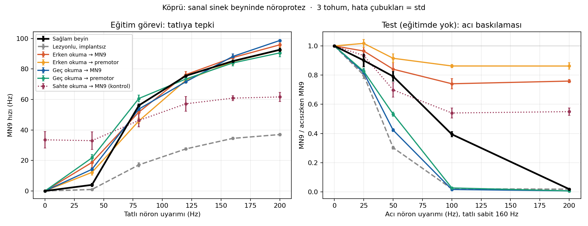
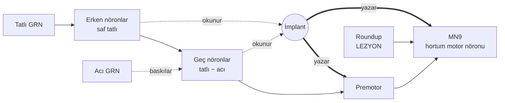

# Köprü: sanal sinek beynine nöroprotez

> Hasarlı bir sinek beynine 2 parametreli minik bir implant tak, onu **sadece tatlıya tepki** görevinde eğit, sonra eğitimde hiç görmediği bir durumla, **acı tatla** test et. İmplant beyni gerçekten mi onarıyor, yoksa sadece çıktıyı mı taklit ediyor?

Viral "sinek beyni Doom oynuyor" projelerinin çoğunda beyinle oyun arasına bir adaptör konur ve "çalışıyor" denir. Sorun şu: yeterince güçlü bir adaptör neredeyse her ağı çalışıyormuş gibi gösterebilir. Köprü bu sorunu deneyin merkezine koyuyor. Ölçtüğü şey şu: **implantı nereye taktığın, beynin eğitimde görülmemiş bir hesaplamasını koruyup korumadığını belirliyor mu?**

## Sonuçlar (3 tohum)



**Kısaca:** Dört gerçek tasarımın hepsi eğitim görevini geçiyor; eğitim performansına bakınca hepsi "onarılmış" görünüyor. Farkı sadece eğitimde hiç görülmeyen acı testi ortaya çıkarıyor. Erken okuyan implantlar acıyı **duymuyor**, geç okuyanlar ise acıyı **fazla duyuyor**. Hiçbiri sağlam beynin kademeli tepkisini geri getiremiyor.

| Koşul | Tatlı hatası (Hz) | Görev | Acı-koruma (0–1) | Yön |
|---|---|---|---|---|
| Sağlam beyin, bağımsız tekrar (gürültü tabanı) | 1,3 ± 0,5 | referans | 0,94 ± 0,03 | +0,01 |
| Lezyonlu, implantsız | 39,8 ± 0,4 | geçemedi | yorumlanamaz (0,49) | −0,24 |
| Erken okuma → MN9'a yaz (kestirme) | 6,9 ± 1,6 | geçti | 0,36 ± 0,05 | +0,30 |
| Erken okuma → premotora yaz | 5,7 ± 1,0 | geçti | 0,18 ± 0,03 | +0,39 |
| Geç okuma → MN9'a yaz | 5,5 ± 0,6 | geçti | 0,55 ± 0,08 | −0,21 |
| Geç okuma → premotora yaz | 7,8 ± 0,4 | geçti | 0,62 ± 0,07 | −0,18 |
| Sahte okuma → MN9'a yaz (kontrol) | 26,0 ± 0,5 | geçemedi | yorumlanamaz (0,58) | +0,15 |

Görev ölçütü: tatlı eğrisi hatası, lezyonlu beynin hatasının yarısından küçük olmalı (< 19,9 Hz). Acı-koruma: 1 = sağlam beyinle aynı, 0 = tamamen kayıp. Yön: artıysa implant acıyı az duyuyor, eksiyse fazla duyuyor. Tohum başına ayrıntılar `results/RAPOR.md` dosyasında.

**Acı altında MN9 oranı** (tatlı 160 Hz sabit, 3 tohum ortalaması)

| Koşul | acı 0 Hz | acı 25 Hz | acı 50 Hz | acı 100 Hz | acı 200 Hz |
|---|---|---|---|---|---|
| Sağlam beyin | 1,00 | 0,90 | 0,79 | 0,39 | 0,02 |
| Sağlam beyin, bağımsız tekrar (gürültü tabanı) | 1,00 | 0,88 | 0,80 | 0,43 | 0,02 |
| Lezyonlu, implantsız | 1,00 | 0,80 | 0,30 | 0,02 | 0,02 |
| Erken okuma → MN9'a yaz (kestirme) | 1,00 | 0,96 | 0,84 | 0,74 | 0,76 |
| Erken okuma → premotora yaz | 1,00 | 1,02 | 0,92 | 0,86 | 0,86 |
| Geç okuma → MN9'a yaz | 1,00 | 0,82 | 0,42 | 0,02 | 0,01 |
| Geç okuma → premotora yaz | 1,00 | 0,83 | 0,53 | 0,03 | 0,01 |
| Sahte okuma → MN9'a yaz (kontrol) | 1,00 | 0,93 | 0,70 | 0,54 | 0,55 |

### Ne anlama geliyor

1. **Eğitim başarısı yanıltıcı.** Dört tasarımın tatlı hatası 5,5–7,8 Hz. Bu değer lezyonlu beyinde 39,8 Hz, gürültü tabanında 1,3 Hz. Sadece eğitim görevine bakan biri hepsini başarılı sayardı.
2. **Erken okuma acıyı duymuyor.** Okunan nöronlar acıdan etkilenmediği için implant acı gelince de uyarmaya devam ediyor. Acı 200 Hz'de MN9 acısız hâlinin %76'sında (MN9'a yazma) ve %86'sında (premotora yazma) kalıyor; sağlam beyinde %2.
3. **Geç okuma acıyı fazla duyuyor.** Acı 50 Hz'de MN9 %42–53'e iniyor; sağlam beyinde %79'da kalıyor. Muhtemel sebep şu: okuma nöronları, acı gelince neredeyse tamamen susan nöronlar olarak seçildi. Bu nöronların tepkisi MN9'un kademeli tepkisinden çok daha keskin.
4. **Okuma yeri, yazma yerinden daha belirleyici.** Geç okumalı iki tasarım da her tohumda erken okumalı iki tasarımdan yüksek acı-koruma aldı. Yazma yerinin etkisi okuma yerine bağlı: erken okumada MN9'a yazmak premotora yazmaktan iyi, geç okumada tersi. Bu sıralamalar üç tohumun her birinde aynı çıktı.
5. **Sahte kontrol neden gerekli?** Sahte implant tatlı görevini geçemedi (26,0 Hz hata) ama acı-koruma skoru 0,58 aldı, çünkü lezyonlu beynin kendi acı devresi hâlâ çalışıyor. Skor görev ölçütü olmadan okunsaydı yanlış sonuca varılırdı.
6. **Açık soru.** Sağlam beynin tepkisi erken ve geç okumanın arasında kalıyor. İki okuma grubu da tatlıya tepki verdiği için, doğru karışımı *sadece tatlı verisiyle* bulmak mümkün olmayabilir. Bu, "Sonraki adımlar" listesindeki ilk deney.

Bu bulgular Shiu et al. LIF modeli içindeki tahminlerdir; gerçek sineklerde test edilmedi.


## Deney düzeni

| Adım | Ne yapılıyor |
|---|---|
| Model | Shiu et al. (2024) tüm-beyin LIF modeli, FlyWire v630 bağlantı verisi: 127.400 nöron, 14,7 milyon bağlantı |
| Davranış | 21 tatlı tat nöronu (GRN) uyarılınca hortum motor nöronu **MN9** ateşleniyor. 21 acı GRN bunu baskılıyor. Bu devre Shiu et al. tarafından gerçek sineklerde doğrulandı |
| Lezyon | MN9'un premotor nöronları olan 2 **Roundup** nöronunun çıkışı kapatılıyor. Tatlıya tepki büyük ölçüde kayboluyor |
| İmplant | Her 10 ms'de okuma nöronlarının ortalama hızına bakıyor: `uyarım = clip(kazanç × (hız − eşik), 0, 200 Hz)`. Yazma nöronlarına bu hızda Poisson uyarımı veriyor. **Sadece 2 parametre** |
| Eğitim | Sadece tatlı doz eğrisi (0-200 Hz). İki aşamalı ızgara aramasıyla sağlam beyne en yakın parametreler seçiliyor |
| Test | Tatlı 160 Hz'de sabitken acı 0-200 Hz. **Eğitimde acı yok** |
| Tekrar | 3 bağımsız tohum. Her tohumda okuma yerleri, eğitim ve test baştan yapılıyor |

**Tasarımlar (2×2 + kontrol)**

|  | MN9'a yaz | Premotora yaz |
|---|---|---|
| **Erken okuma** (saf tatlı bilgisi) | `erken_mn9` (kestirme) | `erken_premotor` |
| **Geç okuma** (tatlı−acı hesabı yapılmış) | `gec_mn9` | `gec_premotor` |
| **Sahte okuma** (hiç ateşlemeyen nöronlar) | `sahte_mn9` (kontrol) | |

Okuma yerleri elle seçilmiyor, kurallarla belirleniyor (`kopru/experiment.py → select_designs`):

- **Erken:** tatlı GRN'lerden 1 sinaps uzakta, tatlıya güçlü tepki (+50 Hz'den fazla), acıdan etkilenmiyor
- **Geç:** en az 2 sinaps uzakta, tatlıya tepki var (+30 Hz'den fazla), acı gelince neredeyse susuyor (acı-baskı indeksi > 0,9)
- **Premotor:** lezyon dışında MN9'a en güçlü uyarıcı girdiyi veren nöron (`720575940619853515`, +154 mV)


*Şema sadeleştirilmiştir; gerçek devrede yüzlerce nöron ve geri besleme var.*

## Kurulum ve çalıştırma

```bash
cd kopru
python3 -m venv .venv && source .venv/bin/activate
pip install -r requirements.txt
./setup_data.sh                       # ~370 MB: FlyWire verisi + Shiu et al. kodu
python run.py validate                # simülatör, makalenin kayıtlı çıktılarıyla ne kadar uyuşuyor?
python run.py all --quick --seeds 0   # hızlı deneme
python run.py all                     # tam deney (3 tohum)
```

Çıktılar `results/` klasörüne yazılıyor: `RAPOR.md` (otomatik tablo), `kopru_sonuc.png`, `summary.json` ve tohum başına JSON dosyaları.
İsteğe bağlı birebir karşılaştırma için: `pip install brian2 joblib && python check_brian2.py`.

## Proje yapısı

| Dosya | Görevi |
|---|---|
| `kopru/connectome.py` | Veriyi yükler, seyrek ağırlık matrisi (CSC) kurar, alt ağ çıkarır |
| `kopru/lif.py` | Batch'li, olay tabanlı LIF simülatörü (Brian2 semantiğiyle) + implant |
| `kopru/neurons.py` | Yayımlanmış nöron ID'leri (tatlı/acı GRN, MN9) |
| `kopru/experiment.py` | Lezyon, okuma/yazma yeri seçimi, eğitim, test, metrikler |
| `kopru/report.py` | Grafik ve otomatik rapor |
| `run.py` | Komut satırı arayüzü |
| `check_brian2.py` | Orijinal Brian2 denklemleriyle birebir karşılaştırma (isteğe bağlı) |

## Teknik notlar

1. **Brian2'nin gizli kuralı.** İlk sürümde ateşleme hızları orijinal modelden ~%24 yüksek çıktı. Brian2'nin ürettiği koda bakınca sebep bulundu: `(unless refractory)` işaretli değişkenlerde, refrakter dönemdeki nörona gelen sinaptik girdiler sessizce **yok sayılıyor**. Bu kural eklenince uyuşma neredeyse birebir oldu (aşağıdaki doğrulama).
2. **Batch = paralel deney.** Durum dizileri `B × N` boyutunda. Her batch elemanı farklı uyarım, susturma maskesi veya implant parametresi kullanabiliyor, böylece yüzlerce parametre kombinasyonu tek simülasyonda deneniyor.
3. **Olay tabanlı iletim.** Her adımda sadece spike atan nöronların CSC sütunları okunuyor. Tam matris çarpımı yapılmıyor.
4. **Aktif alt ağ hilesi.** Bu modelde bazal aktivite sıfır, dolayısıyla hiç spike atmayan bir nöronun ağa etkisi de sıfır. Önce tam beyinde uç koşullar simüle ediliyor, sonra spike atan veya eşiğe 5 mV'tan fazla yaklaşan nöronlar alt ağa alınıyor (~1366 nöron, tam beynin %1'i). Aynı tohumla tam beyinle karşılaştırıldığında MN9 farkı 0,00 Hz çıktı.

## Doğrulama

| Test | Sonuç |
|---|---|
| `python run.py validate`: tam beyin, makalenin kayıtlı Brian2 çıktılarıyla (30 deneme) karşılaştırma, Köprü 10 deneme | Tatlı 200 Hz: r = 0,9997, MN9 93,3 → 92,9 Hz. Tatlı 100 Hz: r = 0,9997, MN9 67,0 → 66,4 Hz |
| `check_brian2.py`: aynı 592 nöronluk alt ağda orijinal Brian2 denklemleriyle | r = 0,9992, medyan hız oranı 1,007, MN9 93,0 → 93,2 Hz. Deneme başına 4,6 s → 0,08 s (Brian2 numpy hedefiyle ölçüldü; C++ hedefi daha hızlıdır) |
| Tam beyin ↔ alt ağ (aynı tohum, 5 tasarım × 4 koşul) | En büyük MN9 farkı 0,00 Hz |
| Süre | Tek CPU çekirdekli bir sandbox'ta tohum başına 3,7–4,1 dk, 3 tohum toplam 11,5 dk |


## Sınırlar ve dürüstlük notları

- Bu bir **model tahmini**, biyoloji değil. LIF + sinaps sayısı modeli nöromodülasyonu, gap junction'ları ve hücreye özgü fizyolojiyi içermiyor.
- Veri FlyWire (dişi beyin, v630). MaleCNS değil, çünkü tatlı → MN9 devresi ve nöron ID'leri Shiu et al. tarafından bu veride doğrulandı ve yayımlandı.
- "Görev başarılı" ölçütü (hata < lezyonlu beynin hatasının yarısı) pilot koşudan **sonra** belirlendi, önceden kayıtlı değil.
- Acı-koruma skoru tek başına yanıltıcı olabilir. Görevi geçemeyen bir implant (ör. sahte kontrol), lezyonlu beynin kendi kalan acı devresi yüzünden yüksek skor alabiliyor. Bu yüzden skor sadece görevi geçen tasarımlar için yorumlanıyor ve işaretli "yön" metriğiyle birlikte okunuyor.
- Tek lezyon, tek davranış, 3 tohum. Genelleme iddiası yok.
- Alt ağın tam beyinle birebir uyuşması yalnızca test edilen koşullarda doğrulandı.

## Sonraki adımlar

1. **Karma okuma ve tanımlanabilirlik:** Erken ve geç okumayı karıştır. İki grup da tatlıya tepki verdiği için, doğru karışımı *sadece tatlı verisiyle* öğrenmek mümkün mü?
2. **İkinci gizli test:** Su GRN'leri de MN9'u uyarıyor (Shiu et al.). Tatlı + su etkileşimi implantla korunuyor mu?
3. **Başka lezyonlar:** G2N_1, peahen ve kombinasyonlar
4. **Kablolama kontrolü:** Derece dağılımını koruyan karıştırılmış bir connectome ile aynı deney
5. **Kendi kendine öğrenen implant:** Ödül sinyaliyle (dopamin benzeri) parametresini çevrimiçi güncelleyen implant
6. **MaleCNS'e taşıma:** Aynı nöron tiplerini erkek beyninde eşleştirip deneyi tekrarlamak
7. **Web paneli:** Sonuçları ve spike aktivitesini tarayıcıda gösteren küçük bir arayüz

## Kaynaklar

- Shiu, P. K. et al. (2024). *A Drosophila computational brain model reveals sensorimotor processing.* Nature. Kod ve veri: [philshiu/Drosophila_brain_model](https://github.com/philshiu/Drosophila_brain_model) (MIT lisansı)
- Dorkenwald, S. et al. (2024). *Neuronal wiring diagram of an adult brain.* Nature (FlyWire)
- Stimberg, M., Brette, R., Goodman, D. F. M. (2019). *Brian 2, an intuitive and efficient neural simulator.* eLife

Kullanılan veri ve model kodu Shiu et al.'a aittir. Yayımlarken onların çalışmasına atıf yap.
